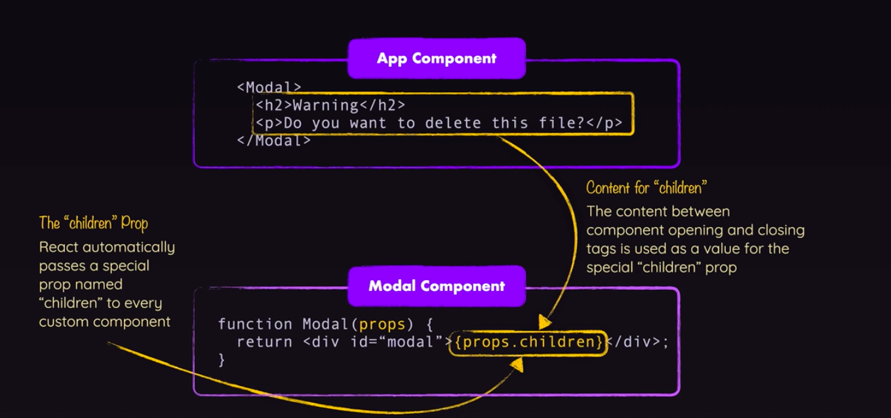
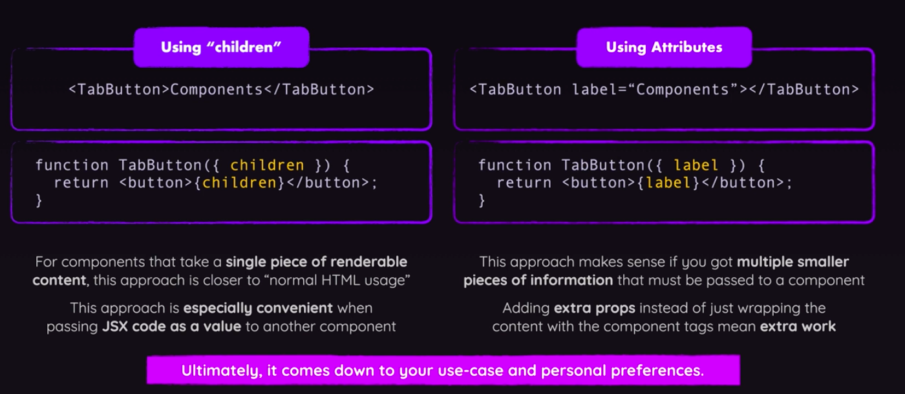

# SCAFFOLDING serio
Come organizzare il codice in un progetto React

Inizialmente tutti i component sono messi nella stessa directory. Ogni component avrà il suo file nella cartella components (Non obbligatorio ma così si fa).

Questi file avranno lo stesso nome del component nel file. 

Tutte le function nei file che poi verranno usati come component devono avere l'export default per poter essere usati da altri file

#### Anche il CSS può essere separato e sia il component sia il css può essere messo in una cartella

# Special Children Prop
Lavoro sulla parte sotto della pagina inserendo un'altra sezione: TabButton.
L'utilizzo della proprietà props.children mi permette di far riferimento al testo all'interno dei tag che richiamano il component. Senza questa proprietà non riuscirei a vedere niente.

ATT: la parola chiave "children" è l'unica che devo utilizzare così com'è. Tutti gli altri props li posso chiamare come mi pare e piace. 

Questo approccio é chiamato COMPONENT COMPOSITION. Non é molto diverso da quello che si è fatto in precedenza.

CI sono due approcci per i children ed entrambi vanno benissimo. E' solo una questione di gusti personali.

# Reazione agli Eventi
L'approccio può sembrare quello classico alla Js avendo la prop onClick sull'elemento. Solo che in questo caso non è nulla di imperativo come in JS bensì di dichiarativo.

